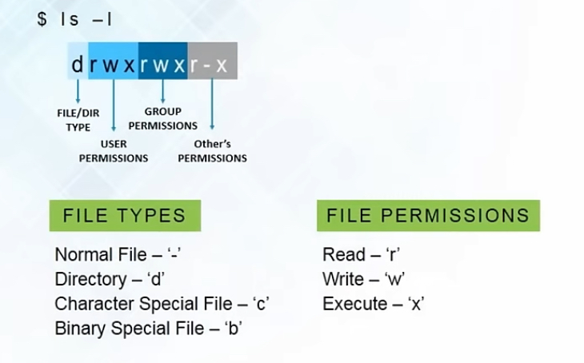
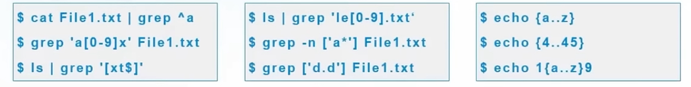

# Road-to-UNIX-Mastery

## common commands

__pwd__

__clear__

__ls [-l]__

__cd__

__echo__

__cat__

__grep__

__sort__

__|, pipe__

__cp [-i, -n, -u, -R, -v]__

__mv [-i, -u, -v]__

__mkdir {folder1, folder2, ...} [-p folder1/folder2/...]__ ***

__rmdir [-p parent_directory/child_directory, -pv ***]__

__rm [-r, -rv]__

__gzip, gunzip, tar [-cvf, -xvf]__

## user permissions

 - chmod [g, u, o, a, +, =, -, r/w/x]
    - chmod [g, u, o, a][+/=/-][r/w/x] [file_name/directory_name]
 - chown [user_name/user_name __:__ group_name (both)]
 - chgrp [group_name]

## installation from linux repos, __sudo__ command
- REHL based
    - `sudo yum update` : get and install any new versions of already installed package
    - `sudo yum install package-name`

- Debian based
    - `sudo apt-get update` : get and install any new versions of already installed package
    - `sudo apt-get install package-name`

- Fedora based
    - `sudo dnf update` : get and install any new versions of already installed package
    - `sudo dnf install package-name`

`sudo gedit .bashrc` : update environment variables in _.bashrc_

`source .bashrc` : sync withe the new env variables

## regular expressions
- . : replaces any character
- ^ : matches the start of string
- $ : matches the end of the string
- \* : matches the preceding character zero or more times
- ? : matches the preceding character one or more times
- () : groups regular expressions
- \ : represents special characters

- examples

__su / su (your username)__ 

__sudo__

## references
[edureka!](https://www.youtube.com/live/bz0ZCUv5rYo?si=OEmxnlY2BrKTUh1r)